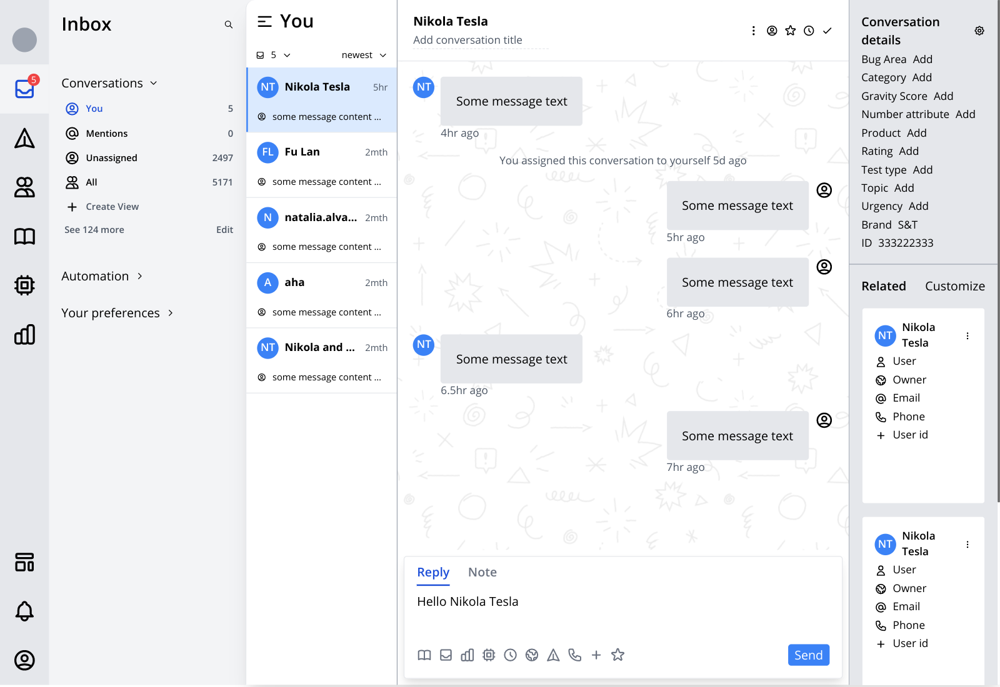

= A sample messaging client

* see 
** https://play.tailwindcss.com/O2Uz6b4uLs
** https://www.intercom.com/

https://fnumatic.github.io/messaging-client/

== doxa

https://github.com/ribelo/doxa

Using doxa as an attempt to use a normalized db in combination with re-frame.

* as of now using
** pull syntax, to control the shape of result set
** datalog query, to filter

== Using babashka

https://github.com/babashka/babashka[babashka]

----
bb watch
bb compile
bb release
bb purgecss
bb buildreport
----

